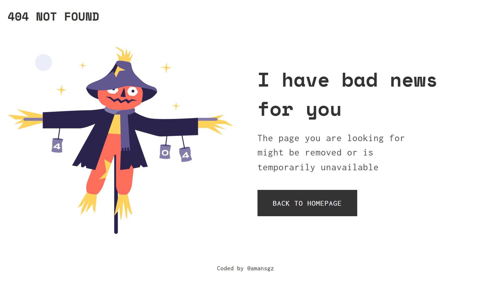

# 404 Not Found Page 

## The challenge

Create a 404 not found page following the figma design. 

## User story   

I can see a page following the given design

## Built With

- CSS

  <h3>
    <a href="https://amansgz.github.io/css-404-not-found/">
      Demo
    </a>
  </h3>

This application/site was created as a submission to <a href="https://legacy.devchallenges.io/paths/responsive-web-developer">Legacy Devchallenges</a>
